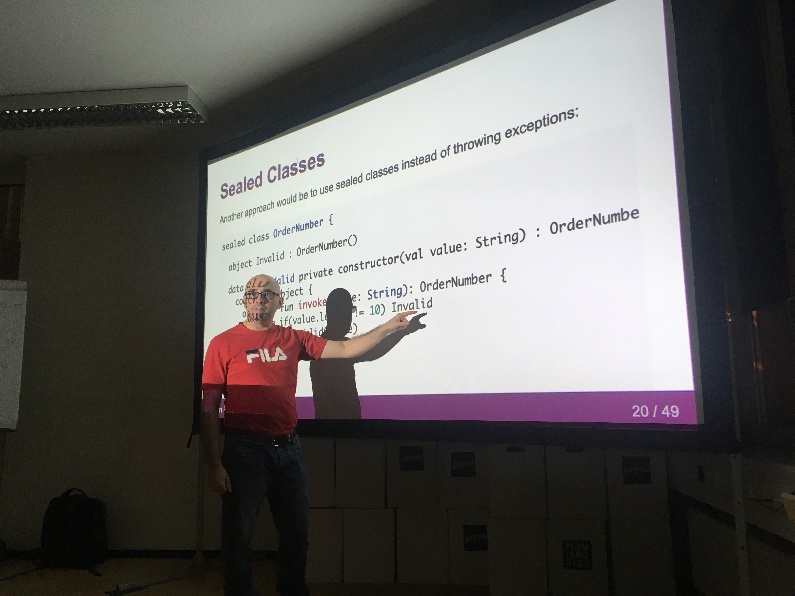

# Domain Primitives

Software bugs have cost lots of money and in some cases killed people.  This impacted large projects and small projects alike and sometimes the bugs were very silly, yet their impact was devastating.  NASA lost its Mars Climate Orbiter due to a metric/imperial mishap in the orbiters' software ([http://edition.cnn.com/TECH/space/9909/30/mars.metric/](http://edition.cnn.com/TECH/space/9909/30/mars.metric/)).

In this presentation, we will discuss such problems and also show alternative approaches, that can be applied to mitigate unwanted behaviour.

.center[]

## Meetups

1. https://www.meetup.com/en-AU/meetup-group-LNHuxrrO/events/268624312/

## Running the Presentation

This presentation is rendered by [Backslide](https://www.npmjs.com/package/backslide), a command line tool for making HTML presentations with [Remark.js](https://github.com/gnab/remark) using [Markdown](https://github.com/adam-p/markdown-here/wiki/Markdown-Cheatsheet).

You can install Backslide, using `npm`

```bash
$ npm install -g backslide
```

You can run the presentation using the `bs` command

```bash
$ bs serve
```

This will start the presentation in the browser, usually [http://localhost:4100](http://localhost:4100).

## Feedback

Feedback makes us better.  Please send any feedback to: `albert.attard@thoughtworks.com`
